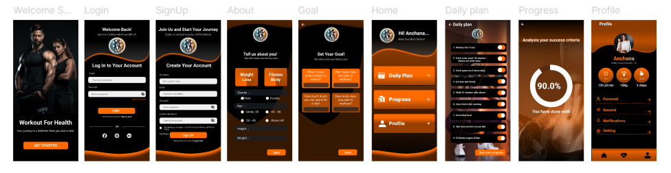

# Health Tracker

A multi-platform Flutter experience for onboarding, coaching, and tracking healthier habits. The app ships with guided onboarding, personalized goal collection, daily habit toggles, progress insights, and a profile hub, all powered by BLoC-driven presentation logic, theming helpers, and device-local persistence.



## Highlights
- **Guided onboarding:** Welcome, sign-up, and about screens capture goals, biometrics, and preferred experience.
- **Authentication flows:** Email/password form validation plus Facebook social login (`flutter_login_facebook`).
- **Coaching surfaces:** Rich `DailyPlanScreen`, `ProgressScreen`, and `ProfileScreen` widgets for toggling habits, browsing stats, and editing info.
- **Offline-friendly UX:** `connectivity_plus` backed `NetworkInfo` guards network calls and surfaces SnackBars when connectivity drops.
- **Custom theming:** `ThemeBloc`, `PrefUtils`, and bespoke typography/styles ensure consistent visuals across light/dark palettes.
- **Localization-ready:** `AppLocalizationDelegate` + `.tr` helpers make copy translatable (English bundle included).

## Screens & Flows
| Screen | Purpose |
| --- | --- |
| `WelcomeScreen` | Hero imagery, CTA to start onboarding. |
| `LoginScreen` / `SignupScreen` | Validated email/password forms, password visibility toggle, Facebook login hook. |
| `AboutScreen` | Collects gender, age, height, weight, and goal selection with animated gradients. |
| `DeatilsScreen` & `DailyPlanScreen` | Toggleable routines, upcoming tasks, reminders via custom switches. |
| `ProgressScreen` | (Bloc-ready) surface for week-by-week analytics. |
| `ProfileScreen` | Tabbed profile page with editable list items, settings, and navigation to other flows. |
| `AppNavigationScreen` | Drawer/debug canvas listing all available routes for QA. |

## Tech Stack
- Flutter 3.4+ / Dart 3.4 (`sdk '>=3.4.4 <4.0.0'`)
- `flutter_bloc` + `equatable` for presentation logic
- `shared_preferences` (`PrefUtils`) for persisting theme + simple state
- `connectivity_plus` for offline detection, `dio` for networking scaffolding
- `cached_network_image`, `flutter_svg`, and bundled PNG/SVG assets for visuals
- Custom responsive helpers via `Sizer` (`lib/core/utils/size_utils.dart`)

## Architecture at a Glance
```
lib/
  core/        # shared helpers (navigation, prefs, theming, logging)
  domain/      # auth facades (Facebook helper) and future business logic
  localization # AppLocalizationDelegate + strings
  presentation # feature-first screens with Bloc folders and widgets
  routes/      # centralized route table + navigation keys
  theme/       # ThemeBloc, text styles, decorations
  widgets/     # reusable controls (buttons, inputs, switches, etc.)
```
- **State management:** Every screen exposes a `builder` that wires up its Bloc (`BlocProvider`, `BlocBuilder`, `BlocSelector`).
- **Navigation:** `NavigatorService` centralizes a `GlobalKey<NavigatorState>` so features can call push/pop without `BuildContext`.
- **Connectivity guardrails:** `NetworkInfo` streams connectivity changes and throws `NoInternetException` that surfaces via `globalMessengerKey`.
- **Localization:** Strings are referenced via `.tr` extension methods, making it simple to add more locales in `lib/localization`.

## Getting Started
1. **Install prerequisites**
   - [Flutter](https://docs.flutter.dev/get-started/install) 3.24+ (Dart 3.4+)
   - Android Studio / Xcode command line tools for native builds
   - Chrome (for web) or Windows/macOS SDKs for desktop
2. **Clone & bootstrap**
   ```bash
   git clone <repo-url>
   cd Health-Tracker
   flutter pub get
   ```
3. **Launch an emulator or connect a physical device**
   ```bash
   flutter devices
   flutter run -d android        # or ios / chrome / windows / macos
   ```

## Useful Commands
- `flutter pub get`: sync dependencies
- `flutter run -d chrome`: web preview
- `flutter run --flavor prod`: if you introduce flavors later
- `flutter analyze`: static analysis (uses `analysis_options.yaml`)
- `flutter test`: execute widget/unit tests (`test/widget_test.dart`)
- `flutter build apk --release`: Android release artifact

## Assets, Fonts & Localization
- All images live under `assets/images/` and are registered in `pubspec.yaml`.
- Custom fonts (`Roboto`, `Lato`, `Inter`) are bundled in `assets/fonts/` and wired into `ThemeData`.
- Localization keys live in `lib/localization`; duplicate the `en_us` folder to add new locales, then extend `supportedLocales` in `main.dart`.

## Extending the App
- **Add APIs:** Implement repositories/services using `dio` and inject them into Blocs. `NetworkInfo` can gate requests.
- **Theme tweaks:** Update `lib/theme` helpers or store user preferences via `PrefUtils().setThemeData`.
- **More locales:** Add `xx_xx` folders, update `AppLocalizationDelegate.supportedLocales`, regenerate ARB/JSON if you adopt Flutter Intl.
- **Testing:** Copy the provided widget test as a template for new flows, mock Blocs with `bloc_test` for deterministic tests.

## Troubleshooting
- **"Command PhaseScriptExecution failed" (iOS):** Run `cd ios && pod install && cd ..`.
- **Missing fonts/images:** Ensure `flutter pub get` succeeds and the asset paths stay under the registered folders.
- **Hot reload stuck:** Run `flutter clean && flutter pub get`.
- **No internet SnackBar spam:** Confirm `Connectivity().onConnectivityChanged` stream is available (emulators sometimes need manual toggles).

## Contributing / Next Steps
- Open issues for bugs or feature ideas, then submit PRs following conventional commits.
- Consider adding CI (GitHub Actions) for `flutter analyze` and `flutter test`.
- Track feature parity by enabling Firebase Auth/Firestore or integrating real habit data.

Happy building!
